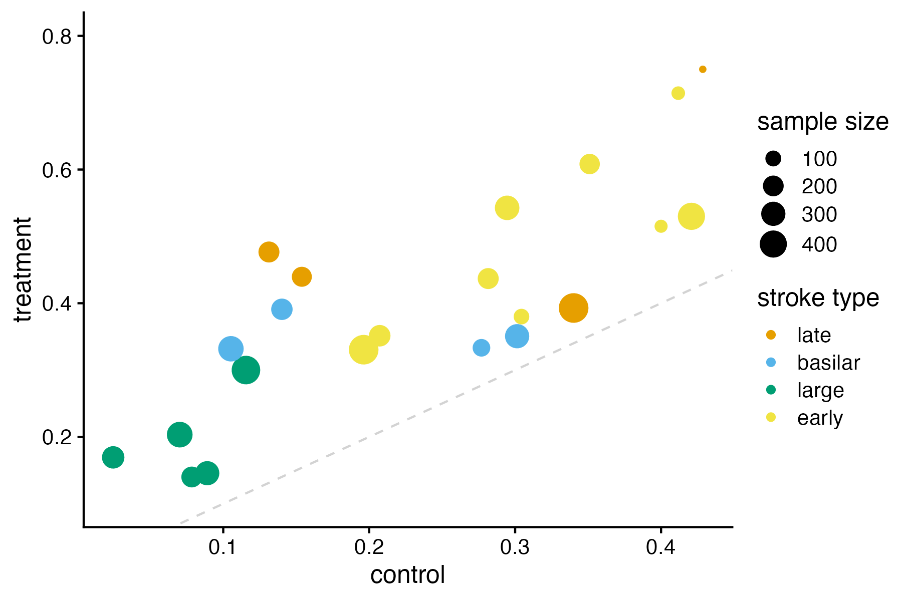
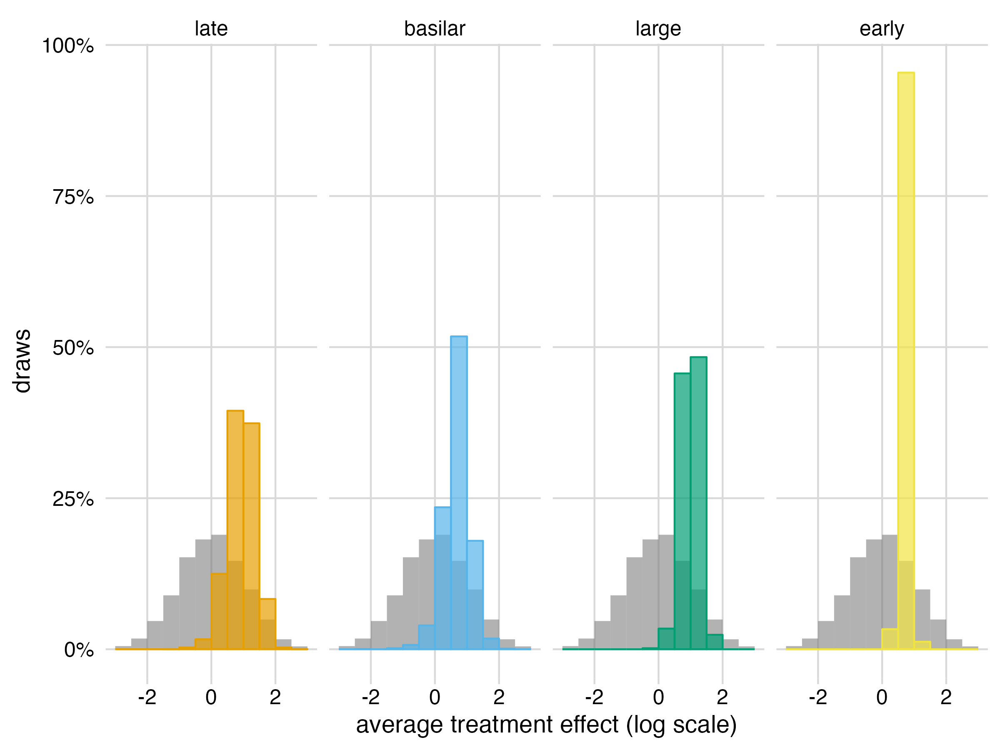
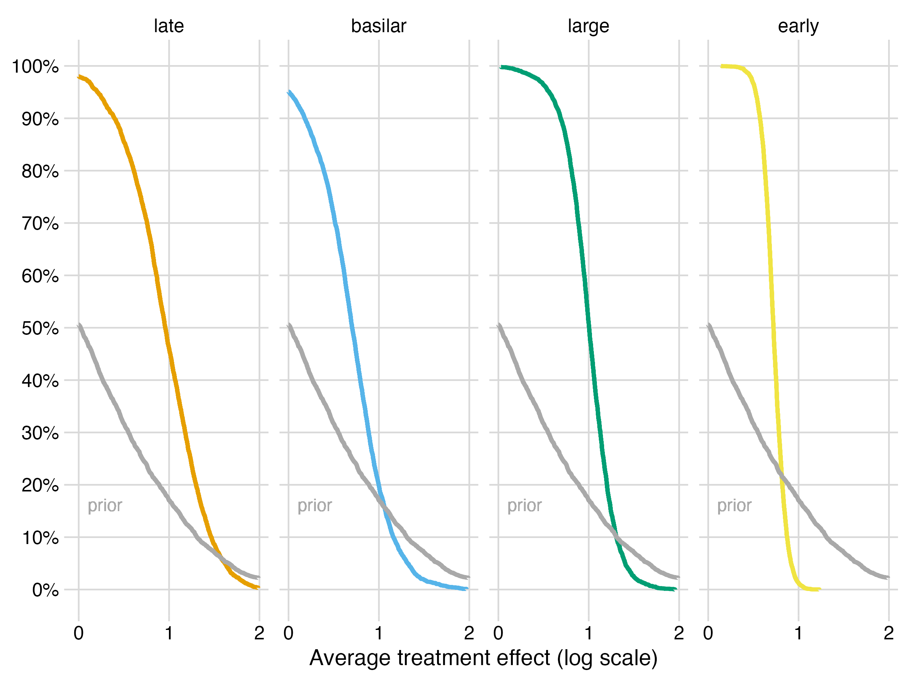
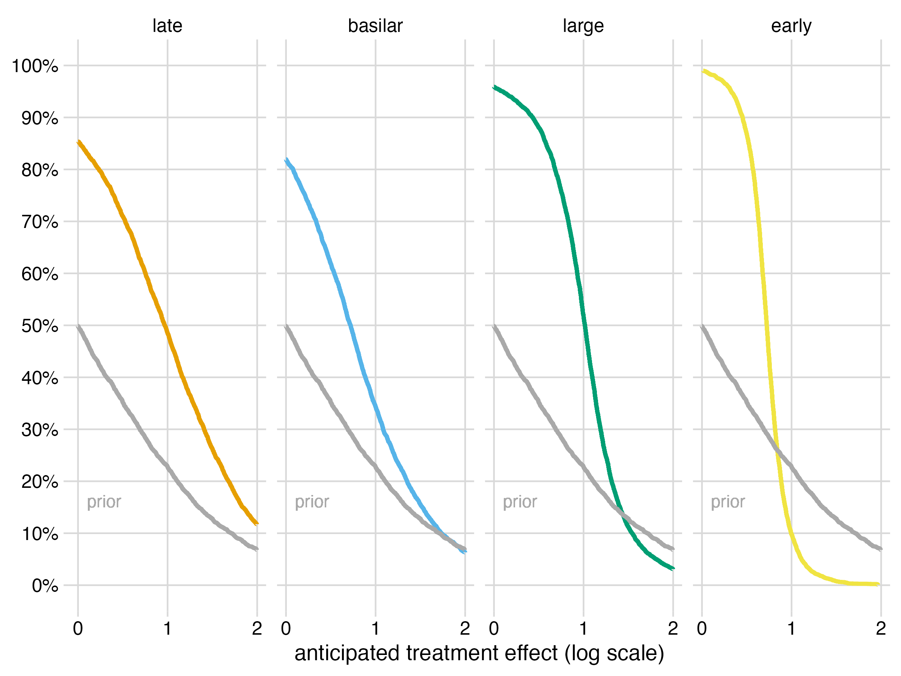

# Comparative effect of thrombectomy

## Observed Data

There were a total of N = 5,513 patients enrolled in J = 22 trials.
2,687 were randomized to best medical management. 2,826 were randomized
to best medical management plus mechanical thrombectomy. Each trial was
categorized into one of K = 4 categories according to the type of stroke
patients enrolled. Category 1 was large anterior circulation strokes.
Category 2 was small to medium sized anterior circulation strokes
treated in an early time window. Category 3 was small to medium sized
anterior circulation strokes treated in a late time window. Category 4
was strokes involving the basilar artery. The primary endpoint was
functional independence at 90 days (modified Rankin score of 0 to 2).

Observed frequency of outcomes for control and treatment groups are
shown below, with color corresponding to stroke type and the size of the
bubble to the sample size of the trial. Bubbles above the grey dashed
line denote trials in which the frequency of good outcome at 90 days was
greater for thrombectomy patients than for those treated with best
medical management only.

Effect sizes from each of the stroke trials are shown here, with $y$
representing the observed treatment effect of thrombectomy (the odds
ratio on the log scale) and $\text{se}$ representing the standard error
for $y$.

    # A tibble: 22 × 5
           J     K name            y    se
       <dbl> <dbl> <chr>       <dbl> <dbl>
     1     1     1 ANGEL       1.19  0.253
     2     2     1 RESCUE      0.649 0.468
     3     3     1 SELECT2     1.22  0.353
     4     4     1 TENSION     2.09  0.632
     5     5     1 TESLA       0.557 0.371
     6     6     2 ESCAPE      1.04  0.240
     7     7     2 EXTEND      1.27  0.511
     8     8     2 MRCLEAN     0.704 0.208
     9     9     2 PISTE       0.466 0.510
    10    10     2 RESILIENT   0.729 0.307
    11    11     2 REVASCAT    0.683 0.296
    12    12     2 SWIFT       1.05  0.300
    13    13     2 THERAPY     0.337 0.433
    14    14     2 THRACE      0.440 0.201
    15    15     3 DAWN        1.80  0.355
    16    16     3 DEFUSE3     1.46  0.359
    17    17     3 MRCLEANLATE 0.228 0.186
    18    18     3 POSITIVE    1.39  0.799
    19    19     4 ATTENTION   1.44  0.336
    20    20     4 BAOCHE      1.37  0.340
    21    21     4 BASICS      0.225 0.247
    22    22     4 BEST        0.267 0.381

The pooled data by category are shown in the following table.

    # A tibble: 4 × 5
      category trials `sample size`     y     se
      <chr>     <int>         <dbl> <dbl>  <dbl>
    1 large         5          1548 1.09  0.159 
    2 early         9          2057 0.723 0.0926
    3 late          4           920 0.757 0.142 
    4 basilar       4           988 0.725 0.149 

The overall pooled data is shown in the following table.

    # A tibble: 1 × 4
      trials `sample size`     y     se
       <int>         <dbl> <dbl>  <dbl>
    1     22          5513 0.744 0.0611

## Average treatment effect

The estimated average treatment effect of thrombectomy across trials for
each stroke type is shown below.

For early stroke, the plotted values correspond to an estimated 106%
average improvement in the odds of functional independence at 90 days
with thrombectomy (95% CI 61.9% to 161%). The probability that the
effect is positive is 100%.

For large stroke, the plotted values correspond to an estimated 173%
average improvement in the odds of functional independence at 90 days
with thrombectomy (95% CI 54.8% to 347%). The probability that the
effect is positive is 99.8%.

For late stroke, the plotted values correspond to an estimated 161%
average improvement in the odds of functional independence at 90 days
with thrombectomy (95% CI 7.9% to 467%). The probability that the effect
is positive is 98%.

For basilar stroke, the plotted values correspond to an estimated 102%
average improvement in the odds of functional independence at 90 days
with thrombectomy (95% CI -15.1% to 319%). The probability that the
effect is positive is 95.1%.

For each effect size greater than the zero, the probability that the
estimated average treatment effect exceeds that value is shown in the
following plot.

## Anticipated treatment effect in a new trial

The anticipated treatment effect of thrombectomy in a hypothetical new
trial for each stroke type is shown below.

Translated from the log scale, the anticipated treatment effect of
thrombectomy in a new early stroke trial has an odds ratio of 2.06 (95%
CI 1.2 to 3.47, P(+) = 99%).

Translated from the log scale, the anticipated treatment effect of
thrombectomy in a new large stroke trial has an odds ratio of 2.76 (95%
CI 0.752 to 8.16, P(+) = 95.9%).

Translated from the log scale, the anticipated treatment effect of
thrombectomy in a new late stroke trial has an odds ratio of 2.63 (95%
CI 0.304 to 20.3, P(+) = 85.4%).

Translated from the log scale, the anticipated treatment effect of
thrombectomy in a new basilar stroke trial has an odds ratio of 2.06
(95% CI 0.261 to 12.2, P(+) = 82%).

The probability that the anticipated treatment effect of thrombectomy in
a new trial for each stroke type is positive is shown in the following
table.

    # A tibble: 4 × 2
      data    prob_pos
      <chr>      <dbl>
    1 large      0.959
    2 early      0.990
    3 late       0.854
    4 basilar    0.820

For each effect size greater than the zero, the probability that the
anticipated treatment effect in a new trial exceeds that value is shown
in the following plot.

